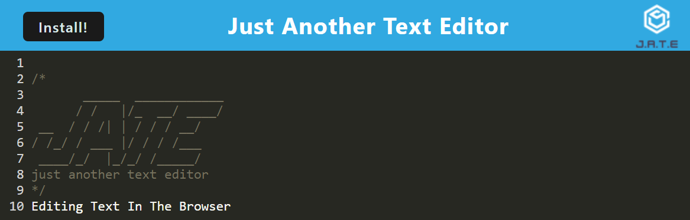

# Text Editor
A text editor that runs in the browser.

## Purpose
A browser-based text editor that operates as a single-page application with Progressive Web App (PWA) functionalities. The editor employs diverse data persistence techniques to ensure redundancy in case certain browser-supported options are unavailable. Furthermore, the application is crafted to seamlessly function offline.

It integrates the idb package, a lightweight wrapper around the IndexedDB API, into the existing application. This package, trusted by industry leaders like Google and Mozilla, provides essential methods for storing and retrieving data. Utilizing these methods enhances the text editor's capability to manage content within an IndexedDB database, ensuring reliable saving and retrieval of textual data.

Through the integration of PWA features and redundant data persistence mechanisms, the text editor guarantees a robust user experience, allowing users to effortlessly create and edit text documents directly within their browser, even in offline scenarios.

## Deployed Webpage Link
https://text-editor-ja-d2ac9317a20c.herokuapp.com/

## User Story

AS A developer

I WANT to create notes or code snippets with or without an internet connection

SO THAT I can reliably retrieve them for later use

## Acceptance Criteria

GIVEN a text editor web application

WHEN I open my application in my editor

THEN I should see a client server folder structure

WHEN I run `npm run start` from the root directory

THEN I find that my application should start up the backend and serve the client

WHEN I run the text editor application from my terminal

THEN I find that my JavaScript files have been bundled using webpack

WHEN I run my webpack plugins

THEN I find that I have a generated HTML file, service worker, and a manifest file

WHEN I use next-gen JavaScript in my application

THEN I find that the text editor still functions in the browser without errors

WHEN I open the text editor

THEN I find that IndexedDB has immediately created a database storage

WHEN I enter content and subsequently click off of the DOM window

THEN I find that the content in the text editor has been saved with IndexedDB

WHEN I reopen the text editor after closing it

THEN I find that the content in the text editor has been retrieved from our IndexedDB

WHEN I click on the Install button

THEN I download my web application as an icon on my desktop

WHEN I load my web application

THEN I should have a registered service worker using workbox

WHEN I register a service worker

THEN I should have my static assets pre cached upon loading along with subsequent pages and static assets

WHEN I deploy to Render

THEN I should have proper build scripts for a webpack application

## Usage & Installation
The website is free to use at this link: https://text-editor-ja-d2ac9317a20c.herokuapp.com/

For local use follow these instructions for installation:
- Clone the text-editor repository
- Make sure you have node.js
- Run the following command to install necessary dependencies:
>    `npm i`
- Run the following command to start server:
>    `npm run start`

## Screenshot
Please refer to the following screenshot(s) as a reference for the application's appearance and functionality:

Main Site 
  

## Code Sources and Collaborators
I had the opportunity to collaborate with my peers Kenny and Mustapha. We checked our work with one another.

In addition, I received feedback from my instructor, Diego, my TA, Andrew, my tutor, Meg, askBCS, as well as some help with commenting using AI tools.

All code used was self-generated or otherwise gathered from class materials.